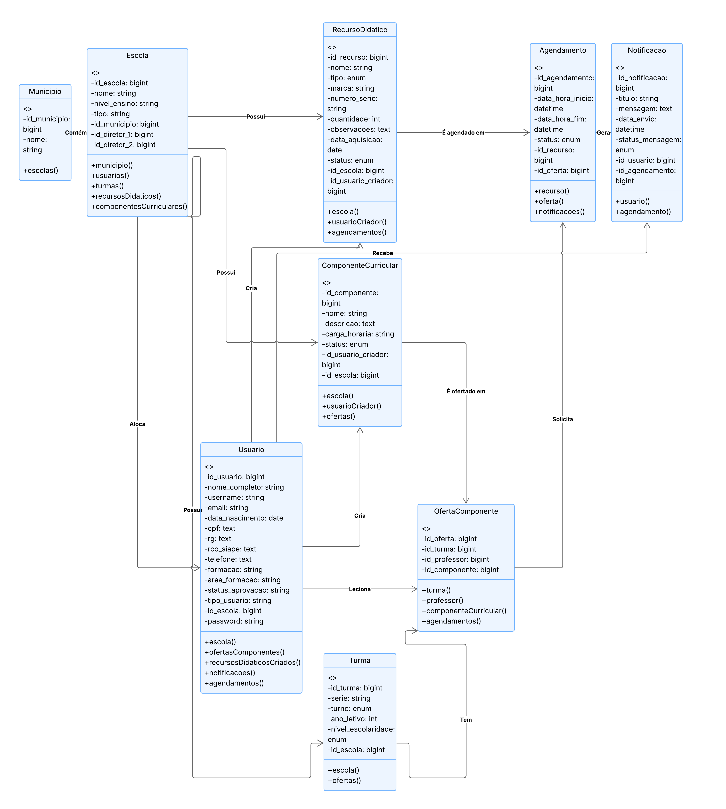
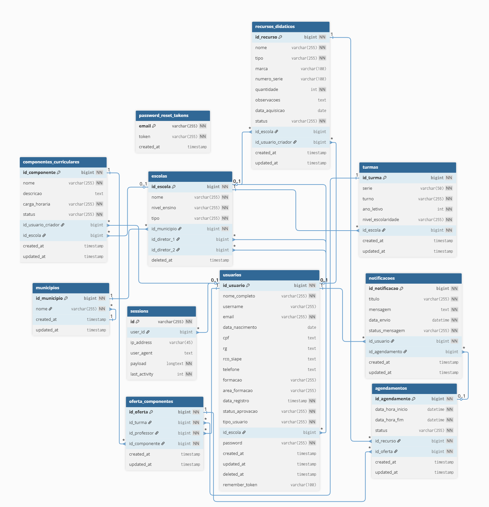

# NREduTech: Sistema Web para Gestão de Componentes Curriculares e Recursos Didáticos

-005596)

## 📋 Resumo do Projeto
Este repositório serve como um compêndio visual dos diagramas de atividade para o projeto **NREduTech**.
O projeto NREduTech é um "sistema Web voltado à gestão de componentes curriculares e recursos didáticos para o Núcleo Regional de Educação de Irati-PR e municípios vinculados". Este repositório documenta visualmente os fluxos de processo e regras de negócio implementadas.
O repositório principal do código-fonte pode ser encontrado em: [victorhjsantiago/nredutech](https://github.com/victorhjsantiago/nredutech).

Desenvolvido por Victor Henrique de Jesus Santiago.
Baseado no TCC: "NREDUTECH: SISTEMA WEB PARA GESTÃO DE COMPONENTES CURRICULARES E DE RECURSOS DIDÁTICOS" (IFPR, 2025).

## 📐 Documentação Arquitetural e Modelagem

Abaixo estão apresentados os artefatos de modelagem do sistema, ordenados conforme a documentação oficial do projeto. Estes diagramas ilustram o comportamento dinâmico (fluxos de atividade) e a estrutura estática (classes e dados) da aplicação.

### 1. Modelagem Comportamental (Diagramas de Atividade)

Os diagramas a seguir detalham os fluxos de trabalho e regras de negócio (RN) implementadas em cada módulo do sistema.

  
<strong>Figura 9 — Gestão de Escolas e Municípios</strong>

  

     
    <em>Fluxo restrito ao Administrador para gerenciar a infraestrutura base do sistema. Inclui verificações de integridade referencial para impedir a exclusão de registros com dependências ativas (RN-033, RN-034).</em>
      
    
  

  
<strong>Figura 10 — Gestão de Turmas</strong>

  

     
    <em>Fluxo de manutenção de turmas. O sistema respeita o escopo de permissão de cada usuário (Administradores visualizam globalmente; Diretores/Professores visualizam apenas sua escola - RN-013) e verifica a existência de ofertas antes da exclusão (RN-015).</em>
      
    
  

  
<strong>Figura 11 — Gestão de Disciplinas (Componentes Curriculares)</strong>

  

     
    <em>Detalha o ciclo de vida dos componentes curriculares, incluindo a distinção entre disciplinas "Globais" e específicas, e o fluxo de aprovação de novas disciplinas cadastradas por usuários não-administradores (RN-038).</em>
      
    
  

  
<strong>Figura 12 — Gestão de Ofertas de Componentes</strong>

  

     
    <em>Representa o processo de associação (vínculo) entre uma Turma, uma Disciplina e um Professor. Inclui validações críticas para evitar duplicidade de ofertas (RN-035) e garantir a integridade dos agendamentos (RN-021).</em>
      
    
  

  
<strong>Figura 13 — Gestão de Recursos Didáticos</strong>

  

     
    <em>Fluxo de cadastro e controle de inventário. Destaca-se a lógica de cadastro em lote (RN-039) e a proteção contra exclusão de itens que possuem histórico de agendamentos (RN-023).</em>
      
    
  

  
<strong>Figura 14 — Gestão de Usuários e Perfis</strong>

  

     
    <em>Diagrama abrangente que cobre três sub-fluxos: 1) Registro público com status "Pendente" (RN-040); 2) Gestão administrativa com hierarquia de papéis; 3) Auto-gestão de perfil e segurança.</em>
      
    
  

  
<strong>Figura 15 — Agendamento de Recursos</strong>

  

     
    <em>Fluxo central do sistema operacional. Detalha as validações de conflito de horário (RN-026), restrições de turno (RN-027) e regras de antecedência para cancelamentos (RN-028).</em>
      
    
  

  
<strong>Figura 16 — Geração de Relatórios</strong>

  

     
    <em>Fluxo de extração de dados gerenciais. Enfatiza o isolamento de dados onde Diretores acessam apenas informações de sua instituição (RN-030), culminando na exportação em múltiplos formatos.</em>
      
    
  

  
<strong>Figura 17 — Configurações (Backup e Restore)</strong>

  

     
    <em>Fluxo de alta segurança restrito a Administradores (RN-031). Exige confirmação de senha (step-up authentication) para execução de operações críticas de banco de dados (RN-044).</em>
      
    
  

---

### 2. Modelagem Estrutural

  
<strong>Figura 18 — Diagrama de Classes</strong>

  

     
    <em>Representação da estrutura estática do sistema, detalhando os atributos das classes, métodos principais e a cardinalidade dos relacionamentos entre as entidades do domínio.</em>
      
    
  

  
<strong>Figura 19 — Modelo Físico de Dados (MER)</strong>

  

     
    <em>Esquema do banco de dados relacional (MariaDB), demonstrando a normalização das tabelas, chaves primárias/estrangeiras e a integridade referencial implementada.</em>
      
    
  

---

## 🎓 Créditos e Referência

**Autor:** Victor Henrique de Jesus Santiago  
**Orientadora:** Prof. Dra. Thalita Scharr Rodrigues Pimenta  
**Instituição:** Instituto Federal do Paraná (IFPR) — Campus Irati  
**Ano:** 2025

> Trabalho apresentado como requisito para obtenção do título de Tecnólogo em Análise e Desenvolvimento de Sistemas.
